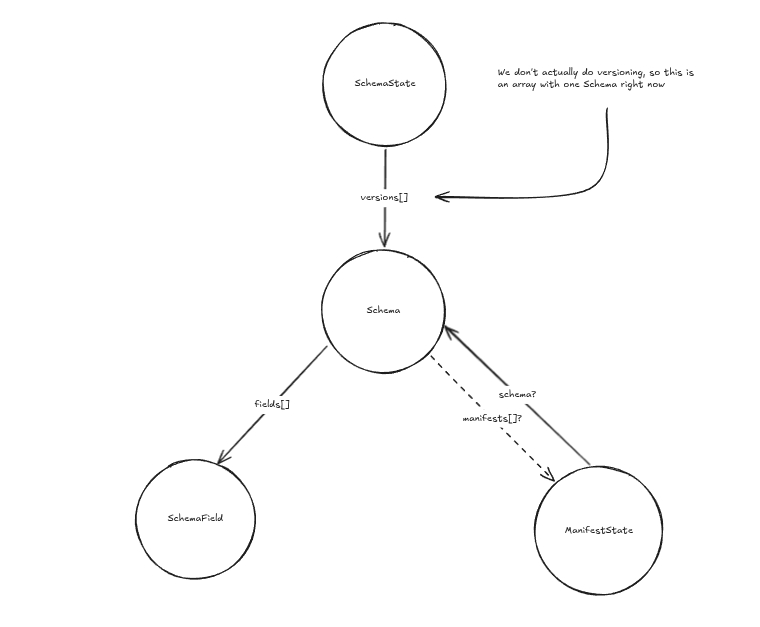
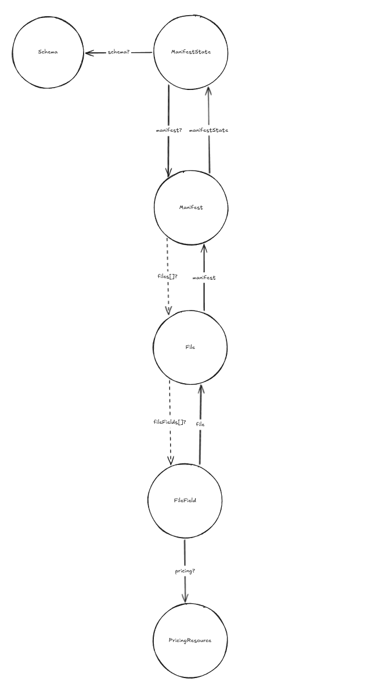

# Fangorn Subgraphs
A collection of subgraphs that are used by Fangorn

## Motivation
Currently, obtaining rich data in the web3 ecosystem is a painful process. At a minimum, you must read from the on chain state for IPFS references and then query for them which leads to a poor user experience.
However, The Graph has created Subgraphs which listen to on-chain events and allow for storage of on-chain data. Not only that, but they also allow for fetching data from IPFS which greatly enhances the developer experience. This means that developers who might be new to the decentralized web/web3 space can query for data in a familiar manner with GraphQL. Subgraphs not only serve as a perfect decentralized backend for traditional web applications,
but they also enable much more responsive and enriched agentic experiences. To experience this, check out the fangorn-agent repo on github. 

## Pre-reqs
Please ensure you have:

0. npm and cargo installed
1. graph-cli installed `npm install -g @graphprotocol/graph-cli@latest`
2. solidity compiler, `solc`, installed
3. cargo stylus installed, `cargo install --force cargo-stylus`

#### Important Files

1. **subgraph.yaml**
This file contains datasources and templates. 
    - **dataSources:** A datasource for us is any contract whose events we will be listening for. It describes what entities will be used, where the abis are located, and what functions will be used for which events.
    - **templates:** A template is used to represent file data that is stored in IPFS. The fields are nearly identical to what is used in the datsources
        >Note that the abis field **is not** actually used but is still required for templates. The file path must be valid and the file must contain a valid ABI, but it can be *any* valid ABI.

2. **schema.graphql:**
This file contains the entities that will be stored for a subgraph. These types will be generated when you run `graph codegen` and stored in the `generated` directory.

### Updating subgraphs when a contract is updated and deployed
1. From the [contracts](https://github.com/fangorn-network/contracts) project, generate the ABI that you need and copy it into the abis directory of the corresponding subgraph project.
    - For stylus, generate the solidity interface `cargo stylus export-abi > abi.sol` and manually add your events to it (literally a copy + paste of the event definitions in the stylus! macro). You can then use this interface to generate `solc --abi abi.sol -o ./abi.json` the proper ABI json. For some reason, generating the the ABI json directly from the stylus contract does not include events.
2. **schema.graphql:**
You will need to define any new types that have been added to the contract. Typically, this will only need to be updated if you have created a new event that you wish for the subgraph to track. Once a new type has been added, you need to run `graph codegen` in order to properly reference these types in your code.
3. **subgraph.yaml:**
You will need to update the corresponding datasource entry with the new address of the contract, the new starting block(Important! If the block is very far in the past it will take the subgraph a long time to update!), the new event (in the entities field), the new abi you have generated, and the new event handler asssociated with the event.
4. **src/your_typescript_file.ts**
Implement any new logic that will be needed to handle any new events or types that you have added.

5. **networks.json:**
Update this file with the new starting block and the new address for the contract.

After you have ensured that your changes are correct and working, navigate to the subgraph studio dashboard, go to the subgraph's dashboard you wish to update, copy the auth command and run it `graph auth whateverSecretItGivesYou`. You can then run `graph build` and `graph deploy your-subgraph-slug`. Make sure you update the version number appropriately when prompted. You can then navigate back to the subgraph's dashboard and use the playground to confirm that everything works as expected.

# Data models
## Convention
1. If an entity has the word `State` in its name, that means it contains the *on-chain* information regarding that entity. The exception to this is PricingResource.
2. In the diagrams, an arrow with a dashed line indicates a virtual pointer and that the relations are created  via `@derivedFrom`
3. `?` means a field is nullable

It is good to have an understanding on how data is structured in the subgraphs since it is directly correlated with how you will query for data.
### Schemas


### Manifests


### Querying the Subgraph
The entities defined in the subgraph each have a link from parent to child and vice versa. Please look at the [diagrams](./diagrams/) for how data is structured.

#### Querying for data: parent entity -> child entity
Below are two examples for obtaining data based on the parent entities.

```graphql
{
  schemaStates {
    versions {
      manifest {
        files {
          fileFields {
            name
            value
            pricing {
              price
              currency
            }
          }
        }
      }
    }
  }
}
```

```graphql
{
  manifestStates {
    manifest {
      files {
        fileFields {
          name
          value
          pricing {
            price
            currency
          }
        }
      }
    }
  }
}
```

#### Querying for data: child entity -> parent entity
It is often beneficial to query for full datasets based on some field in a child entity.

```graphql
{
  fileFields (where: {name: "fieldNameYouWantToFilterBy", value: "theValueYouWantToQueryBy"}) {
    file {
      manifest {
        manifestState {
          manifest {
            files {
              fileFields{
                name
                value
                pricing {
                  price
                  currency
                }
              }
            }
          }
        }
      }
    }
  }
}
```
> Note: In the above query, assume only a single manifest exists that has the file field name "fieldNameYouWantToFilterBy" and field value "theValueYouWantToQueryBy". If that name value pair exists in two files in the single manifest, then that manifest will be returned *twice*. The subgraph client handles this already by filtering for unique manifests, but custom queries must keep this GraphQL limitation in mind.

For information related to filtering please check [The Graph's Subgraph docs](https://thegraph.com/docs/en/subgraphs/querying/graphql-api/).

#### History
We store the entire history of interactions of Manifests(Publish/Update), Pricing information(Created/Updated), and Schema information(Registered/Updated). These are all immutable and allow for a history to be maintained by the Subgraph.